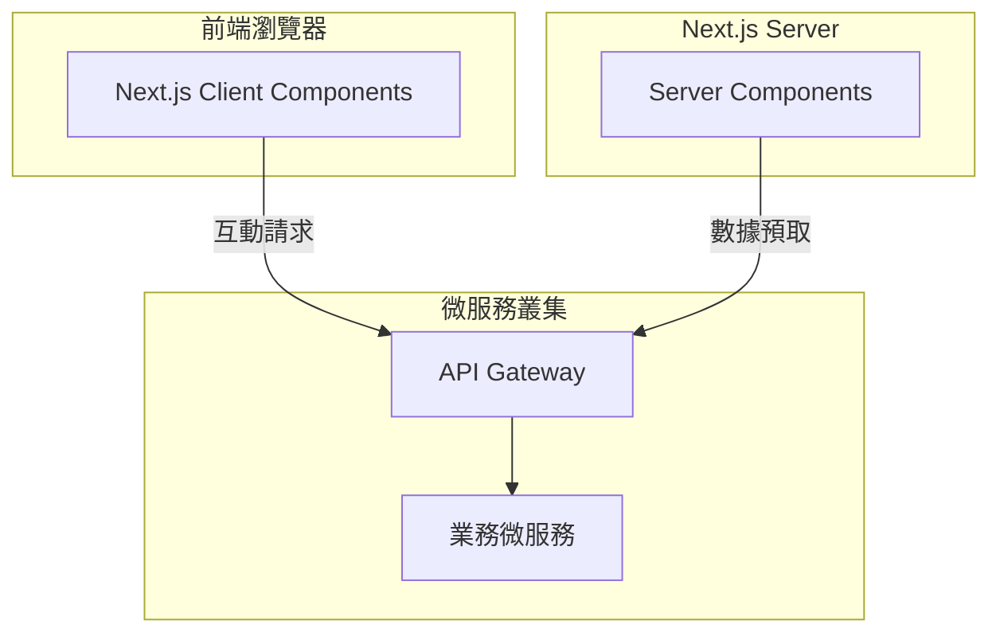
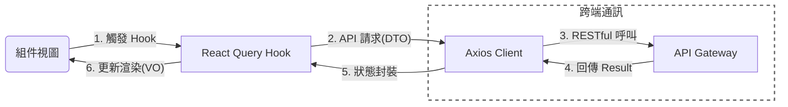

# Nameless Mall Frontend v1.0

基於 Next.js 14 + Tailwind CSS 的微服務電商前台視圖。

- **線上 Demo**：https://isaliveqwq.me
- **後端 Repo**：https://github.com/IsAliveQwQ/Nameless-Mall.git

## 技術堆疊

**核心框架**
- Next.js 14.2.16 (App Router)
- React 18.x / TypeScript 5.x

**UI 與樣式系統**
- Tailwind CSS (原子化樣式)
- shadcn/ui (Radix UI)
- Framer Motion (互動動畫)
- Lucide React (圖標庫)

**狀態管理與數據請求**
- TanStack Query v5 (伺服器狀態管理)
- Axios (封裝攔截器)
- Zustand (使用者狀態)
- React Hook Form / Zod (表單驗證)

**DevOps**
- Docker (Multi-stage Build)
- GitHub Actions (CI/CD)

## 系統架構



## 目錄結構

```
nameless-mall-front/
├── app/                        # 路由核心與 Server Components
├── components/                 # 全域通用 UI 元件 (Shadcn UI)
├── features/                   # Feature-First 業務模組分割
│   ├── [feature]/
│   │   ├── api/                # 業務專屬 API 封裝
│   │   ├── components/         # 業務專屬 UI/佈局
│   │   ├── hooks/              # 業務邏輯 (React Query)
│   │   ├── stores/             # 狀態管理 (Zustand)
│   │   └── types/              # 業務專屬型別定義
├── lib/                        # 全域工具類別 (API Client、Utils)
├── public/                     # 靜態資源 (Assets、Images)
├── shared/                     # 跨模組共用資源
│   ├── types/                  # DTO / VO 型別對齊 (TypeScript)
│   ├── components/             # 跨業務共用組件
│   ├── hooks/                  # 通用 Hooks (如 useIntersectionObserver)
│   ├── data/                   # 靜態數據 (區域、常數定義)
│   └── lib/                    # 共用邏輯 (驗證、格式化)
├── styles/                     # 全域樣式設定 (Tailwind Directives)
├── middleware.ts               # 下一個 JS 中間件 (路由守衛)
└── Dockerfile                  # 生產環境鏡像定義
```

## 統一回應格式

前端嚴格遵循後端 `Result<T>` 應答契約，並由 Axios 攔截器統一處理業務例外。

**成功回應 (HTTP 200)**
```json
{
  "code": "OK",
  "message": "成功",
  "data": { ... }
}
```

**錯誤回應 (HTTP 4xx/5xx)**
```json
{
  "code": "STOCK_INSUFFICIENT",
  "message": "庫存不足",
  "data": null
}
```

| code | HTTP Status | 說明 |
|------|-------------|------|
| `OK` | 200 | 成功，剝離外殼回傳 data |
| `UNAUTHORIZED` | 401 | 未登入或 Token 失效，觸發登出 |
| `INVALID_ARGUMENT` | 400 | 參數驗證失敗，觸發 Toast 通知 |
| `SERVICE_UNAVAILABLE` | 503 | 服務異常，顯示負載錯誤訊息 |

## 全域異常處理

透過 `lib/api/client.ts` 中的 Axios 攔截器捕捉業務異常，確保與後端 API 契合：

```typescript
// Response Interceptor
axiosInstance.interceptors.response.use(
    (response) => {
        const result = response.data as Result<unknown>;
        // 1. 若成功則回傳資料載體
        if (result.code === 'OK') return result.data;
        
        // 2. 處理認證失效邏輯
        if (isAuthError(result.code)) {
            useAuthStore.getState().clearAuth();
        }
        // 3. 拋出業務異常
        throw new BusinessError(result.code, result.message);
    }
);
```

## 資料傳輸模式



**物件職責劃分**
- **Server Components**: 負責首屏數據預取 (SSR)，優化 SEO 與 效能表現。
- **Client Components**: 負責複雜互動、狀態切換與客戶端異步請求。
- **Shared Types**: 嚴格定義對位後端 VO 的 TS Interface，確保型別安全。

## License

MIT
